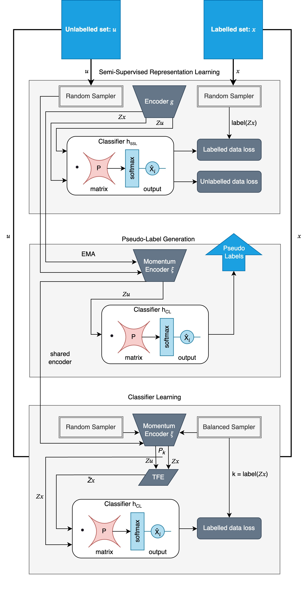

# Imbalanced-Semi-Supervised-Learning-With-Maximum-Separation

## Abstract 

Semi-supervised learning (SSL) is a popular approach that leverages both labelled and unlabeled data to improve model performance. However, when dealing with imbalanced datasets, SSL can result in biased models that favour majority classes. To address this issue, we propose MSCoSSL (Maximum Separation Co-Learning for Semi-Supervised Learning), a novel technique that integrates the Maximum Separation (MS) approach into the Co-Learning with Semi-Supervised Learning (CoSSL) framework. By enhancing the separation between decision boundaries through a fixed matrix multiplication before the softmax activation, MSCoSSL aims to improve classification accuracy, especially for the weakest classes. This research investigates the impact of the MS bias on SSL performance and explores optimal labelled-to-unlabeled data ratios. Our experimental results demonstrate the effectiveness of MSCoSSL in addressing class imbalance challenges and enhancing SSL performance on imbalanced datasets.

## Setup

* `python 3.7`
* `pytorch == 1.0.0`
* `torchvision == 0.2.2.post3`
* `randAugment (Pytorch re-implementation: https://github.com/ildoonet/pytorch-randaugment)`
* `torchvision`
* `progressbar`

<p align="center">
    
</p>

> Figure:
The MSCoSSL framework extends the CoSSL framework decoupling representation learning and classifier training. It comprises three modules: a semi-supervised representation learning module, a balanced classifier learning module, and a pseudo-label generation module each with a maximum separation matrix applied before a softmax activation. These modules enhance each other, leading to a more powerful representation and a balanced classifier with maximally separated classes.

## Running Experiments

Provided are two .sh files labeleld `run_cifar10.sh` and `run_cifar100.sh` which will allow you to replicate all the tests documented in the research paper.


### Example MixMatch with MSCoSSL @ Imbalance ratio of 100
To run the MSCoSSL framework on CIFAR-10 at imbalance ratio 100 with MixMatch backbone

# 
Run pretrain representation learning phase:
```
python train_cifar_mix.py --ratio 2 --num_max 1500 --imb_ratio_l 100 --imb_ratio_u 100 --epoch 500 --val-iteration 500 --out ./results/cifar10/mixmatch/baseline/wrn28_N1500_r100_seed1/ --manualSeed 1 --gpu 0 --matrix True
```
Applying MSCoSSL:
```
python train_cifar_mix_mscossl.py --ratio 2 --num_max 1500 --imb_ratio_l 100 --imb_ratio_u 100 --epoch 100 --val-iteration 500 --resume ./results/cifar10/mixmatch/baseline/wrn28_N1500_r100_seed1/checkpoint.pth.tar --out ./results/cifar10/mixmatch/mscossl/wrn28_N1500_r100_lam06_seed1 --max_lam 0.6 --manualSeed 1 --gpu 0 --matrix True
```

To run the same test on the original CoSSL framework, the parameter --Matrix needs to be set to false or omitted.

Run pretrain representation learning phase:
```
python train_cifar_mix.py --ratio 2 --num_max 1500 --imb_ratio_l 100 --imb_ratio_u 100 --epoch 500 --val-iteration 500 --out ./results/cifar10/mixmatch/baseline/wrn28_N1500_r100_seed1/ --manualSeed 1 --gpu 0
```
Applying CoSSL:
```
python train_cifar_mix_mscossl.py --ratio 2 --num_max 1500 --imb_ratio_l 100 --imb_ratio_u 100 --epoch 100 --val-iteration 500 --resume ./results/cifar10/mixmatch/baseline/wrn28_N1500_r100_seed1/checkpoint.pth.tar --out ./results/cifar10/mixmatch/mscossl/wrn28_N1500_r100_lam06_seed1 --max_lam 0.6 --manualSeed 1 --gpu 0 
```

## This paper is based highly off of two notable research studies.

CoSSL: Co-Learning of Representation and Classifier for Imbalanced Semi-Supervised Learning
: Repository : https://github.com/YUE-FAN/CoSSL/tree/main
: Research Paper: https://arxiv.org/abs/2112.04564


MaximumClass Separation as Inductive Bias in One Matrix
: Repository : https://github.com/tkasarla/max-separation-as-inductive-bias
: Research Paper : https://arxiv.org/abs/2206.08704